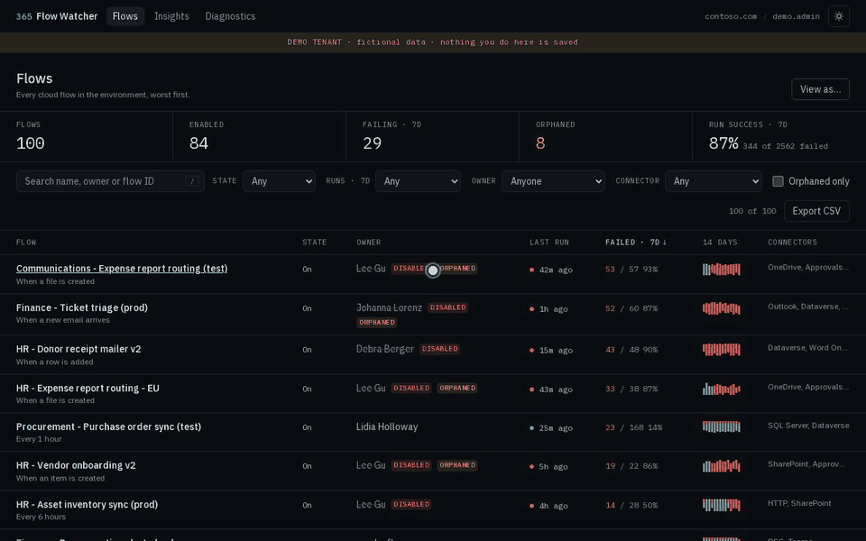
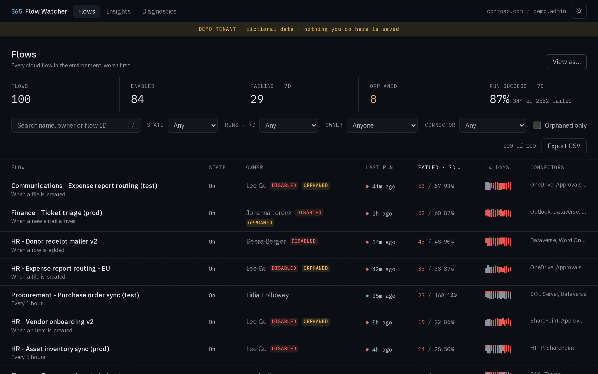
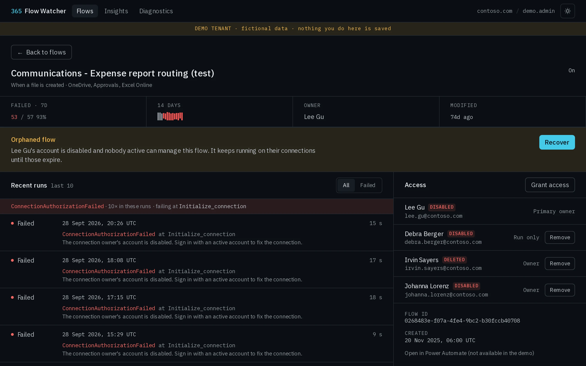
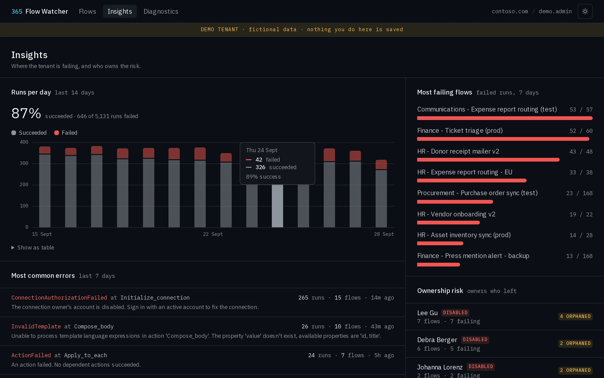
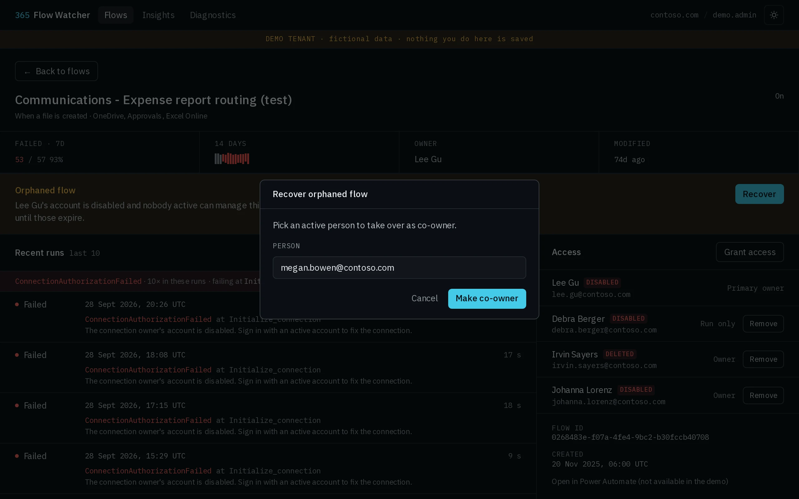
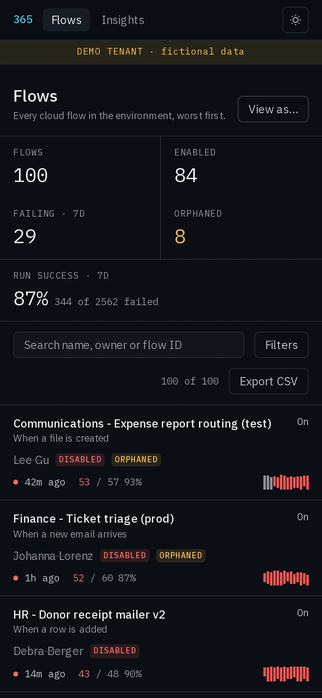
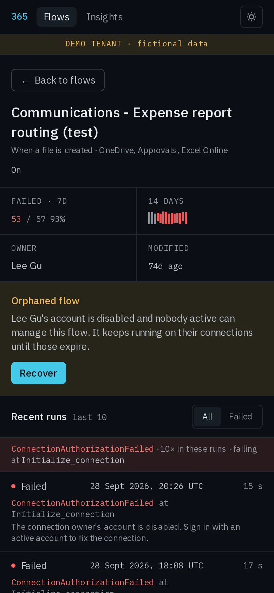
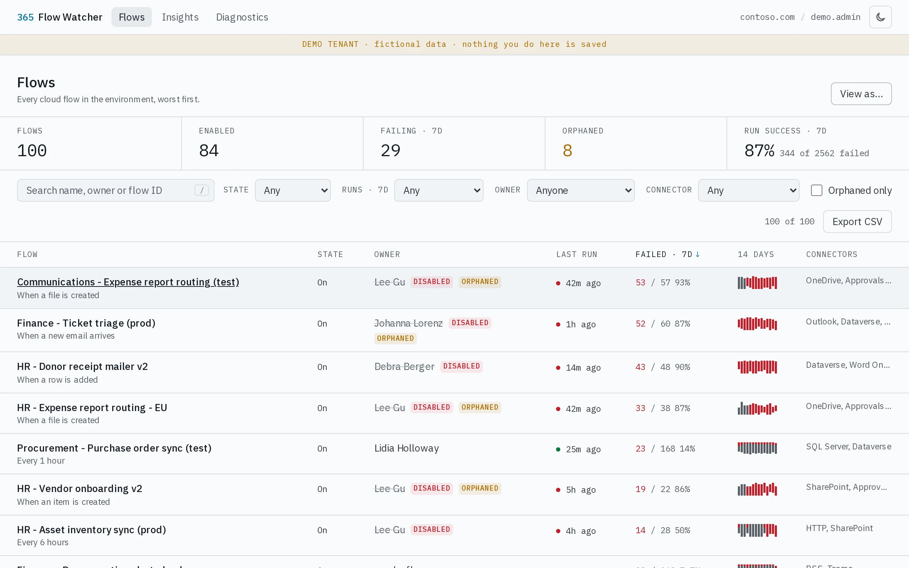
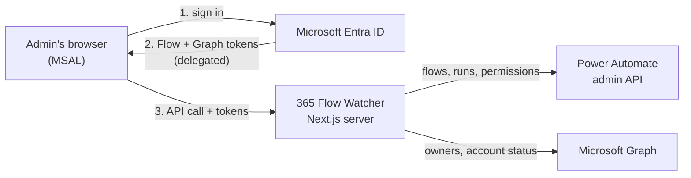
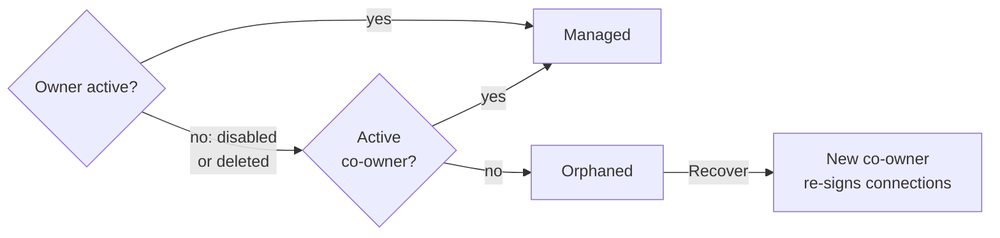

# 365 Flow Watcher

[](https://github.com/Jakbor32/365-flow-watcher/actions/workflows/ci.yml)
[](LICENSE)
[](https://365-flow-watcher.vercel.app)

Watch, audit and secure Power Automate flows across your Microsoft 365 tenant: what is failing, what nobody owns any more, and who has access.

**[Try the live demo](https://365-flow-watcher.vercel.app)**: fictional tenant, no sign-in, nothing is saved.



<sub>All screenshots use the built-in demo tenant (fictional Contoso data).</sub>

## Why

The Power Automate portal shows flows one at a time. When someone leaves, their flows keep running on their connections until they break, and the failure emails go to a disabled mailbox. This dashboard shows the whole environment at once and lets an admin fix ownership before it becomes an incident.

## Features

- **Inventory** of every cloud flow, worst first: failures, last run, 14-day sparkline, filters, search, CSV export
- **Run history** with error code, failing action and message
- **Orphaned flows**: owner disabled or deleted and no active co-owner, with one-click **Recover**
- **Access**: see owners, grant or remove co-owners (off by default, managers only, audited)
- **Insights**: success rate, most common errors, most failing flows, ownership risk
- **View as** another person, **Diagnostics** for setup, dark and light theme, works on a phone

<table>
  <tr>
    <td></td>
    <td></td>
  </tr>
  <tr>
    <td></td>
    <td></td>
  </tr>
</table>

<table>
  <tr>
    <td valign="top" width="25%"></td>
    <td valign="top" width="25%"></td>
    <td valign="top" width="50%"></td>
  </tr>
  <tr>
    <td colspan="2" align="center"><sub>On a phone</sub></td>
    <td align="center"><sub>Light theme</sub></td>
  </tr>
</table>

## How it works



- The server has **no secret**. It checks the tokens (tenant, audience, same user), reads the user from Graph and calls Microsoft with the user's own permissions.
- Nothing is stored. Results are cached for two minutes, per user.

How a flow is marked orphaned:



## Try it

```bash
docker compose up -d     # with DEMO_MODE=true in .env (copy .env.example)
```

or `npm install && DEMO_MODE=true npm run dev`, then open http://localhost:3000.

## Connect your tenant

You need three IDs. Where each one comes from:

1. [Register an app in Entra ID](docs/setup/1-entra-app.md): tenant ID, client ID (no secret)
2. [Find your Power Platform environment](docs/setup/2-environment.md): environment ID
3. [Run it with Docker](docs/setup/3-run.md)

Then create a `.env` like this one (example values, use your own):

```ini
DEMO_MODE=false

# Entra admin center > App registrations > your app > Overview
AZURE_TENANT_ID=8f3c2a51-6d0e-4b7a-9c21-5e4f8a7b3d10
AZURE_CLIENT_ID=2a91e7c4-3b5f-4d28-a6e0-9f1c7b24d5e8

# make.powerautomate.com/environments/<this>/flows
POWER_PLATFORM_ENVIRONMENT_ID=Default-8f3c2a51-6d0e-4b7a-9c21-5e4f8a7b3d10

# Must match the SPA redirect URI in the app registration
APP_URL=http://localhost:3000

# Optional: only flows owned by these accounts (faster on big environments)
WATCHED_FLOW_ACCOUNTS=svc-automation@contoso.com,it-admin@contoso.com

# Optional: who may grant/remove co-owners, and whether that is on at all
ACCESS_MANAGERS=it-admin@contoso.com
ENABLE_GRANT_ACCESS=false
```

and start it, reachable from this machine only:

```bash
docker build -t 365-flow-watcher .
docker run -d --name flow-watcher -p 127.0.0.1:3000:3000 --env-file .env \
  --read-only --tmpfs /tmp --tmpfs /app/.next/cache \
  --cap-drop ALL --security-opt no-new-privileges:true \
  365-flow-watcher
```

Open http://localhost:3000, sign in, then check **Diagnostics**: everything required should be green.

> Running it on a server? Keep it on `127.0.0.1` and tunnel in with `ssh -L 3000:127.0.0.1:3000 you@server`. Your browser still opens `http://localhost:3000`, so the redirect URI stays the same.

The first load reads every flow's recent runs: about 25 seconds for 200 flows. After that, filters and navigation are instant until you press **Refresh**. All settings: [configuration.md](docs/configuration.md).

## Security

- Delegated permissions only, no client secret, no database.
- Writes (grant/remove access) are off unless `ENABLE_GRANT_ACCESS=true`, limited to `ACCESS_MANAGERS`, confirmed in the UI and logged as JSON audit lines.
- Strict per-request CSP with a nonce; the container runs as non-root on a read-only filesystem.
- Trade-offs: MSAL keeps tokens in `localStorage` so a sign-in survives new tabs (CSP limits the XSS risk); there is no rate limiting, as this is an internal admin tool.

## Development

```bash
npm run check   # lint, typecheck, format, tests
```

CI runs the same checks plus a production build, `npm audit` and a Docker smoke test on every push.

## License

[MIT](LICENSE)
